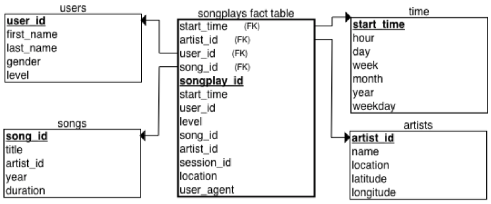

Project 1: Data Modeling with Postgres
===========================

Udacity Data Engineer Nanodegree project
----------------------------------------

### Schema design and ETL pipeline

The star schema has 1 fact table (songplays), and 4 dimension tables (artists, songs,  time, users).



`DROP`, `CREATE`, `INSERT`, and `SELECT` queries are set in **sql_queries.py**. 

**create_tables.py** uses functions `create_database`, `drop_tables`, and `create_tables` to initiate the database sparkifydb and the required tables.

### Requirements for running locally

- Python3
- Postgres

### Project structure explanation

```
README.md        # Project description

data             # The dataset
│               
└───log_data
    │   │  ...
    └───song_data
        │  ...

notebooks:
etl.ipynb        # ETL helper notebook
test.ipynb       # Psql queries notebook

scripts:
create_tables.py # Schema creation script
etl.py           # ETL script
sql_queries.py   # Definition of all sql queries
```
